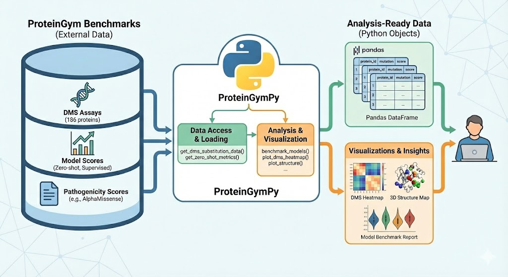

ProteinGymPy
========================
[](https://proteingympy.readthedocs.io/en/latest/)


# Overview

ProteinGym comprises a collection of benchmarks for evaluating the performance of models predicting the effect of point mutations generated by Notin et al., 2023. These datasets include Deep Mutational Scanning Assays (DMS) for 186 proteins, as well as performance scores for several models in both zero-shot and semi-supervised settings.

ProteinGymPy provides analysis-ready data resources from ProteinGym ([Notin et al., 2023](https://papers.nips.cc/paper_files/paper/2023/file/cac723e5ff29f65e3fcbb0739ae91bee-Paper-Datasets_and_Benchmarks.pdf)) and built-in functionality to visualize the data in Python. ProteinGym comprises a collection of benchmarks for evaluating the performance of models predicting the effect of point mutations. This package provides access to:

1. Deep mutational scanning (DMS) scores from 217 assays measuring the impact of all possible amino acid substitutions across 186 proteins, and
2. Model performance metrics and prediction scores from 79 variant prediction models in a zero-shot setting and 12 models in a semi-supervised setting.



# Installation
To install the software, we recommend using [uv](https://docs.astral.sh/uv/#installation) for python package management:

```
uv venv --python=3.13  #create a venv
source .venv/bin/activate 
uv pip install `ProteinGymPy`
```

Addtional packages are required for jupyter notebook visualization functions:

```
uv pip install 'ProteinGymPy[visualization]`
```

To pull in the latest commits directly from github, use the following:

```
uv pip install 'ProteinGymPy[visualization] @ git+https://github.com/ccb-hms/ProteinGymPy.git'
```

# Usage

## Quick Start

Load DMS substitution data (217 assays):
```python
from proteingympy import get_dms_substitution_data

# Load all DMS assays with UniProt IDs  
dms_data = get_dms_substitution_data()
print(f"Loaded {len(dms_data)} DMS assays")

# Access specific assay
assay_name = list(dms_data.keys())[0]
df = dms_data[assay_name]
print(df.head())
```

Load other datasets:
```python
from proteingympy import (
    get_alphamissense_proteingym_data,
    get_zero_shot_metrics,
    get_supervised_substitution_data
)

# AlphaMissense pathogenicity scores
am_data = get_alphamissense_proteingym_data()

# Zero-shot benchmarking metrics  
benchmarks = get_zero_shot_metrics()
print(f"Available metrics: {list(benchmarks.keys())}")

# Supervised model predictions
supervised_data, summary = get_supervised_substitution_data("random_5")
```

## Available Functions

| Function | Description |
|----------|-------------|
| `get_dms_substitution_data()` | Load 217 DMS substitution assays |
| `get_dms_metadata()` | Load DMS assay metadata/reference file |
| `get_alphamissense_proteingym_data()` | Load AlphaMissense pathogenicity scores |
| `get_supervised_substitution_data()` | Load supervised model predictions for DMS subsitutions |
| `get_zero_shot_substitution_data()` | Load zero-shot model predictions for DMS subsitutions |
| `get_zero_shot_metrics()` | Load zero-shot benchmarking metrics |
| `get_supervised_metrics()` | Load supervised benchmarking metrics |
| `available_supervised_models()` | Get list of available supervised models |
| `available_zero_shot_models()` | Get list of available zero-shot models |
| `create_complete_metadata_table()` | Generate comprehensive metadata |
| `benchmark_models()` | Benchmark multiple variant effect prediction models |
| `dms_corr_plot()` | Correlate model performance and DMS scores|
| `model_corr_plot()` | Compare two model performance scores |
| `plot_dms_heatmap()` | Visualize DMS scores along a protein as a heatmap |
| `plot_structure()` | Visualize DMS or model scores on 3D protein structure |


## Running Examples

Run the full example script (includes data downloads):
```bash
source .venv/bin/activate
python examples/proteingym_pipeline_examples.py
```

This demonstrates all available data loading functions and shows the structure of each dataset.

## Running Tests

Run the test suite to verify functionality:
```bash
source .venv/bin/activate
python -m pytest tests/ -v
```

Or run specific test files:
```bash
source .venv/bin/activate  
python tests/test_data_pipelines.py
python tests/test_basic.py
```

The tests include:
- Unit tests for all data loading functions
- Integration tests for complete workflows  
- Mock tests that don't require network access
- Validation of data structure and consistency

## Documentation building

This project uses [Mkdocs](https://www.mkdocs.org/) as a project document builder. Static docs can be built by installing the extra dependencies
after cloning the repo
```bash
#git clone https://github.com/ccb-hms/ProteinGymPy.git
cd ProteinGymPy
uv sync --extra mkdocs
uv run mkdocs build

```


## Citation
```
Notin, P., A. Kollasch, D. Ritter, L. van Niekerk, S. Paul, H. Spinner, N. Rollins, et al. 2023. “ProteinGym: Large-Scale Benchmarks for Protein Fitness Prediction and Design.” In Advances in Neural Information Processing Systems, edited by A. Oh, T. Neumann, A. Globerson, K. Saenko, M. Hardt, and S. Levine, 36:64331–79. Curran Associates, Inc.
```
